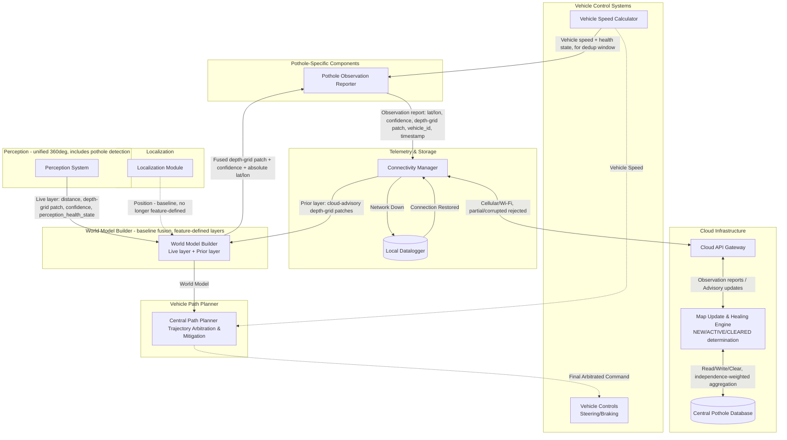

# Block diagram - Autonomous Vehicle Pothole Detection and Avoidance System

## Architectural Basis

This design is built on patterns documented in current AV perception/planning literature and patents, rather than an ad-hoc pipeline invented for this feature. Key assumptions and the basis for each:

1. **Road-surface data is fused as one layer within the World Model Builder's existing multi-layer, multi-channel world representation, not handled by a dedicated sidecar component.** Documented architecture maintains multiple layers or channels, each carrying a distinct type of content — occupancy, visibility, or ground-surface semantics such as elevation, surface type, or friction — accumulated into one combined representation [1][11]. This feature contributes a Prior layer (cloud-sourced) and a Live layer (Perception-sourced), both populating a road-surface elevation channel, rather than performing its own separate object-level matching before handing off a result. Elevation and cost/friction are documented as alternative, coexisting layer content types within such a representation [11] — this feature's elevation-typed layers do not need to be converted into a shared cost representation to participate in it. The World Model Builder's own fusion mechanism (how it combines layers into one estimate per cell, and how the resulting multi-channel output is consumed downstream) is baseline — this feature defines what goes into its own layers, not the mechanism itself.
2. **A single, unified 360-degree perception system, not per-direction subsystems.** Multi-sensor AV perception is documented as fusing camera and LiDAR data from multiple zones into one unified representation [4]; some architectures fuse directly into a shared bird's-eye-view representation for exactly this reason [2].
3. **Detection, classification, and tracking are commonly distinct algorithmic stages within Perception** [3]. This diagram does not decompose Perception's internals to that level.
4. **Perception stays lightweight: raw detection data only, no severity categorization or response planning.** This motivates keeping Perception's output limited to object geometry and a confidence score [5] — severity interpretation and response strategy belong downstream.
5. **Robustness against a single observation being wrong comes from fleet-scale diversity of independent observations over time, not from redundant onboard sensor modalities.** Crowdsourced road-condition systems are documented as building confidence by aggregating observations across many vehicles and passes [6][7], rather than requiring a single vehicle to physically confirm a hazard before reporting it. This feature does not use a physical confirmation sensor (e.g., jerk/IMU) at all — a genuinely correct visual detection should not go unreported merely because the vehicle successfully avoided the hazard it detected, and the aggregate multi-vehicle, multi-condition observation record is a more scalable and more complete confidence mechanism than any single vehicle's physical confirmation could be.
6. **A pothole is represented as a local 2.5D depth-grid patch, not a bounding-box summary.** 2.5D elevation maps — a 2D grid where each cell stores a height/depth value — are documented, standard practice for representing terrain and road-surface geometry in robotics and off-road/on-road navigation stacks [8][9], including systems that explicitly generate a grid of depth values for pothole-containing road sections rather than a dimensional summary [10]. This is the accurate representation for Path Planner's purposes: it allows computing how much a specific tire would actually drop at a given point in the anomaly, rather than working from a single averaged depth figure. A bounding-box summary was carried in earlier versions of this design and is corrected in this revision (see Version History) — it was inconsistent with having already adopted grid-based layer fusion (point 1 above), since a bounding box still requires object-level interpretation downstream, the very thing grid fusion is meant to eliminate.

**References**
[1] Layered Cost Map patent, describing an ordered list of layers accumulated into a master costmap. https://image-ppubs.uspto.gov/dirsearch-public/print/downloadPdf/12236779
[2] Roberge, "BEVFusion: Unifying Vision in Autonomous Driving Systems," Medium, 2025. https://medium.com/demistify/av-vol-3-bevfusion-unifying-vision-in-autonomous-driving-systems-b2190f877c9b
[3] "Sensor Fusion and Perception for Autonomous Driving: A Critical Review of Modalities, AI Models, Algorithms, and Industry Configurations," MAKE, 2026. https://doi.org/10.3390/make8070199
[4] "A Review of Multi-Sensor Fusion in Autonomous Driving," MDPI Sensors, 2025. https://www.mdpi.com/1424-8220/25/19/6033
[5] "Real-Time Hybrid Multi-Sensor Fusion Framework for Perception in Autonomous Vehicles," MDPI Sensors, 2019. https://www.mdpi.com/1424-8220/19/20/4357
[6] "Sustainable Road Pothole Detection: A Crowdsourcing Based Multi-Sensors Fusion Approach," Sustainability, 2023. https://www.mdpi.com/2071-1050/15/8/6610
[7] "Pothole Patrol (P2)" — opportunistic crowdsourced road-condition sensing across a vehicle fleet. https://www.researchgate.net/publication/283111351_Road_anomaly_estimation_Model_based_pothole_detection
[8] "Occupancy-elevation grid: an alternative approach for robotic mapping and navigation" — defines 2.5D elevation maps, each grid cell storing a height value. https://www.cambridge.org/core/services/aop-cambridge-core/content/view/94FC3DD044922CE20CC074D9EADB18B9/S0263574715000235a.pdf/div-class-title-occupancy-elevation-grid-an-alternative-approach-for-robotic-mapping-and-navigation-div.pdf
[9] "An Open-Source LiDAR and Monocular Off-Road Autonomous Navigation Stack" — generates a robot-centric 2.5D elevation map for costmap-based planning. https://arxiv.org/pdf/2604.03096
[10] "Method and system for navigating vehicles based on road conditions determined in real-time" — digital elevation images with per-grid depth/height values, explicitly applied to road sections containing potholes. https://image-ppubs.uspto.gov/dirsearch-public/print/downloadPdf/11417119
[11] "Creating a representation of visible space around a machine using a previously determined combined occupancy grid" — multi-layer grid architecture where each layer carries a distinct content type; explicitly names a ground-surface layer whose content may be elevation, surface type, or friction as alternative options, not a single shared representation. https://image-ppubs.uspto.gov/dirsearch-public/print/downloadPdf/12522249

These are cited to explain *why* this architecture is shaped the way it is, not as a claim that this document reproduces any cited system exactly.

---

### 1. Perception (includes pothole detection)
A single, unified perception stack covering the full 360-degree field around the vehicle (Camera + LiDAR, fused into one representation), consistent with [2] and [4]. Internally comprises detection, classification, and tracking [3], not decomposed further here. Pothole detection is one object/hazard class among others, not a separate feature bolted onto Perception.

- **Output, per pothole candidate:** distance from ego vehicle, a local 2.5D depth-grid patch (relative elevation/depth values across a small N×M cell area, per [8][9][10]), and a confidence score. No persistent identifier is assigned here — grid-based fusion (Section 3) identifies locations by spatial cell, not by object ID, so Perception does not need to track candidate identity across cycles. **Sign convention:** depth values are negative for depressions (below the surrounding road-surface baseline) and positive for raised anomalies (debris, bumps) — applied consistently everywhere depth values appear in this feature's interfaces (interfaces.md #1, #2, #3, #5).

- **Two independent signals:** pothole_confidence_score is a per-detection quality signal. perception_health_state (NOMINAL / DEGRADED / FAULTED) is a system-level compute/thermal status, independent of it. Under compute pressure, pothole classification is dropped first — Perception's own internal prioritization.

- **Output routing:** feeds the World Model Builder's Live layer directly (Section 3) — this feature's only defined interface for Perception's pothole-specific output. General object/lane content feeds the World Model Builder through its own baseline channels, unaffected by this feature.

### 2. Localization
GPS and HD Map integration providing vehicle coordinates. No longer a feature-defined interface (see Section 8's note) — the World Model Builder already requires Localization for all of its layers, pothole-related or not, so this feature does not define its own separate consumption of it, unlike the prior architecture where a dedicated component needed its own direct feed.

### 3. World Model Builder (baseline — layer content defined by this feature, fusion mechanism is not)
Consumes multiple layers from Perception and other vehicle perceivers and continually maintains the unified world model Path Planner consumes, consistent with [1]. This feature contributes two layers:

- **Live layer:** populated directly from Perception's pothole candidates (Section 1) — distance, a local depth-grid patch, confidence, updated every cycle.

- **Prior layer:** populated directly from the Connectivity Manager's cloud-advisory pothole list (Section 6) — the cloud's last-known state for this vehicle's geographic sector, also carried as a depth-grid patch per entry.
The World Model Builder's own fusion logic combines these two layers, per grid cell, into one fused depth-grid patch and confidence estimate — elementwise matrix fusion, the same general-purpose mechanism it already applies to combine any other set of layers into its unified multi-layer world representation [1][11]. This feature does not define that fusion algorithm; it defines what the two layers contain. There is no explicit object-level matching step (no "is Live Pothole A the same as Cloud Pothole B" correlation) — spatial co-location in the same grid cell is what fusion naturally resolves.

**Behavior under degraded input — a functional requirement, distinct from the fusion algorithm above.** Fusion math assumes both inputs are trustworthy; this feature must state what happens when one is not, since that is input-quality handling specific to this channel, not something a generic fusion mechanism can be expected to know on its own:

When perception_health_state is DEGRADED or FAULTED, an absent or empty Live layer for that cycle must not be treated as a confident "nothing here" — it is missing information, not a negative observation. The fused result must fall back to the Prior layer alone for that cell, not a fusion that implicitly averages a degraded absence against a valid Prior value as if it were a real zero.

When the cloud-advisory list is unavailable or beyond its staleness threshold (undefined threshold, open item — see fmea.md), the Prior layer must not be treated as "nothing expected here" either — the fused result must fall back to the Live layer alone.
When both are simultaneously degraded or unavailable, the fused result carries no meaningful signal for this channel for that cell and should not be reported at all — this reduces the vehicle to baseline (pre-feature) risk for that location

### 4. Pothole Observation Reporter
Single responsibility: watch the fused Live+Prior confidence in the vehicle's local grid window and, when a change is significant enough to be worth sharing, emit a lightweight observation report to the Connectivity Manager. This is a much thinner role than the prior architecture's Verification Engine — it does not determine NEW / ACTIVE / CLEARED status. A single vehicle was never actually positioned to make that determination on its own; it is inherently a fleet-level judgment, made by aggregating many vehicles' observations (Section 5), and that aggregation requires each observation to carry an absolute location — the cloud cannot fuse reports from different vehicles without knowing where each one was taken.

- **Input:** the World Model Builder's fused grid-cell output for the pothole/road-surface channel (Section 3), including each cell's absolute lat/lon — not just a relative grid position. This component does not need its own separate Localization feed as a result: the World Model Builder is assumed to convert its (typically ego-relative) grid representation to absolute coordinates internally, using its own Localization access (Baseline Dependency E), before exposing fused output here — consistent with it already needing a global reference to correlate against HD maps for its other functions. **This is an assumption about baseline behavior, not something this feature can verify** — if the World Model Builder does not actually perform this conversion (e.g., if it only exposes ego-relative positions internally), this component would need its own direct Localization access after all, reopening a dependency this design otherwise eliminates.

- **Second input:** current vehicle speed and its health state, from the Vehicle Speed Calculator (interfaces.md #4) — a feature-defined consumption of a baseline signal, distinct from the Vehicle Speed Calculator's separate, baseline connection to Path Planner. Used to compute the deduplication suppression window (perception coverage radius ÷ current speed) so the same physical candidate is not reported repeatedly while it remains in view. If vehicle_speed_health_state is DEGRADED or FAULTED, the Reporter shall not transmit any report to the cloud until a valid speed reading is available again — an invalid speed reading cannot support a trustworthy suppression-window calculation, and reporting under that condition risks either flooding the cloud with duplicate reports or suppressing genuine ones for an unknown, unbounded duration.

- **Behavior:** a threshold/debounce condition (exact values TBD, a validation-team deliverable, not asserted here) determines when a change in fused confidence is worth reporting — avoiding reporting every frame's minor fluctuation.

- **Output:** an observation report — absolute patch position (patch_center_lat/lon), fused confidence, the fused depth-grid patch, timestamp, and a vehicle/session identifier (needed downstream so the cloud can distinguish genuinely different vehicles from the same vehicle reporting repeatedly) — to the Connectivity Manager. Does not assert a status; that determination happens only after aggregation (Section 5).

### 5. Cloud Infrastructure (Fleet Intelligence)

- **Central Pothole Database:** Stores all geotagged anomalies as depth-grid patches, each with the cloud's own persistent identifier — assigned by the cloud when it creates an entry from aggregated observations, not carried by any individual vehicle's report.

- **Map Update & Healing Engine:** This is now the sole place NEW / ACTIVE / CLEARED status is determined — aggregating observation reports across multiple vehicles by matching their reported lat/lon, weighted by independence, before updating the database. Independence is the load-bearing safeguard against correlated false positives (e.g., many vehicles passing the same location under the same lighting all misreading the same shadow) — at minimum, diversity in reporting time (from each report's timestamp) and diversity in reporting vehicle (from the vehicle/session identifier) are available signals; whether additional context (weather, lighting condition) is needed for a more robust independence check is not currently modeled in this architecture and remains an explicit open item. Also where recommended_speed_limit is computed — a more sophisticated, non-real-time algorithm, consistent with the edge/cloud compute-split basis in [5].

- **Downstream API:** Broadcasts the aggregated advisory list to vehicles in the specific geographic sector.

### 6. Telemetry & Storage Layer (Communication)

- **Connectivity Manager:** Relays the Pothole Observation Reporter's reports to the Cloud Server, and supplies the cloud-advisory pothole list to the World Model Builder's Prior layer (Section 3). Intermittent, partial, or corrupted-in-transit messages — distinct from a clean full disconnection — are rejected outright and not partially processed.
    * Note: The Connectivity Manager is assumed to authenticate and validate all incoming cloud data at the point it receives it from the network, before forwarding to any consumer. Baseline architecture, not this feature's to define.

- **Local Datalogger (The Fallback):** If cellular/Wi-Fi connection drops entirely, this logs the encrypted data locally and executes a bulk sync upon reconnection.

### 7. Path planner and Vehicle controls

- **Path Planning System:** Ingests the world model from the World Model Builder — its only input, for this feature or any other perceiver. This feature has no direct connection to Path Planner at all, and does not command, request, or track whether any maneuver is executed — that determination, and any bound on the magnitude or type of response, is Path Planner's own pre-defined, inherited arbitration logic.

- **Vehicle Controls (Actuation):** Executes the steering or braking commands generated by the Path Planning System. Pre-existing vehicle architecture — this feature does not define it.

**Note on connections not defined by this feature:** Vehicle Speed Calculator → Central Path Planner, the World Model Builder → Path Planner connection, Central Path Planner → Vehicle Controls, and Localization → World Model Builder are all baseline vehicle architecture, not drawn as feature-specific interfaces. The Vehicle Speed Calculator has two separate destinations in this diagram: its connection to Path Planner remains baseline and undefined by this feature, while its connection to the Pothole Observation Reporter (Section 4, interfaces.md #4) is a separate, feature-defined consumption of that same baseline signal — the two should not be conflated.

---

## Version History

**Version 1 — Initial draft.** Perception (forward-only, implicitly dedicated), Jerk/IMU, Sensor Fusion, Localization, Geotagging & Verification Engine, Telemetry & Storage, Cloud Infrastructure, Path Planner, and Vehicle Controls, as a single linear pipeline.

**Version 2.** Added health/confidence signaling; an Enablement Gate; an Output Arbitrator selecting between real-time and cloud-advisory records; a split of the original Geotagging & Verification Engine into three components; a coarse braking_level category; explicit rejection of intermittent/partial cloud data.

**Version 3.** 
 - Feature updated to be inline with state of the art AV architecture. World Model Builder introduced as explicit baseline architecture. Path Planner's only input became the World Model Builder's output.
 - Introduced Pothole Cloud-Overlay Engine.
 - Central Path Planner → Vehicle Controls moved from a feature-defined interface to Baseline Dependency

**Version 4.** 
Current. A fundamental restructuring, following independent review against documented SOTA patterns (multi-layer world-representation fusion; crowdsourced, sensor-independent confidence aggregation):

- Pothole Cloud-Overlay Engine and Verification Engine eliminated as distinct components. Their function is replaced by two layers (Live, Prior) fed directly into the World Model Builder's existing multi-layer fusion mechanism, and a much thinner Pothole Observation Reporter that triggers lightweight reports on significant fused-confidence change — no explicit object-level matching, no entry_type state machine.
- Jerk/IMU sensor removed entirely. Physical confirmation is no longer part of this feature's design. The robustness argument shifts from onboard sensor redundancy to fleet-scale observation diversity — multiple vehicles, multiple times, multiple conditions — consistent with documented crowdsourced road-condition systems [6][7]. This closes the avoidance paradox completely (not just for CLEARED, as Version 4 did, but for NEW/ACTIVE too): a vehicle that visually detects and then successfully avoids a real pothole still reports what it saw, since reporting no longer depends on physical contact at all.
- NEW/ACTIVE/CLEARED determination moved entirely to the cloud's Map Update & Healing Engine, aggregating observation reports across vehicles. A single vehicle no longer asserts a status — it reports an observation. Independence of reports (not just their count) is now the single most safety/quality-relevant open question in this design, since it is the sole defense against correlated false positives with the physical-confirmation backstop removed.
- pothole_id removed from Perception's and the Reporter's outputs — grid-based fusion identifies locations spatially, not by persistent object ID. Retained on cloud-sourced data, where it reflects the cloud database's own internal bookkeeping.
- Localization → World Model Builder reclassified from a feature-defined interface to a baseline dependency — the dedicated component that needed its own direct feed no longer exists.
- Clarification within this version: made explicit that the World Model Builder's fused output to the Pothole Observation Reporter carries absolute lat/lon, not just an internal grid position, and stated as an explicit assumption that the World Model Builder performs the local-to-global conversion itself — cloud-side fleet aggregation depends on this, and it was previously described too vaguely ("already spatially referenced") to make that dependency clear.
- Pothole representation is now a local 2.5D depth-grid patch — a small N×M matrix of relative elevation/depth values at a defined grid resolution, centered on an absolute lat/lon for cloud-sourced or fused entries — consistent with documented 2.5D elevation-map practice for road-surface representation.
- Terminology correction within this version: "costmap" is replaced throughout with "multi-layer/multi-channel world representation." A single flat costmap was never an accurate description — documented multi-layer grid architectures carry distinct content types per layer (occupancy, visibility, ground-surface elevation, friction) rather than one shared scalar [11]. Elevation and cost/friction are named as alternative layer content types in that same source, not values requiring conversion into one another — this feature's elevation-typed layers stand on their own within the larger representation, and this correction does not change any requirement's substance, only the terminology describing it.