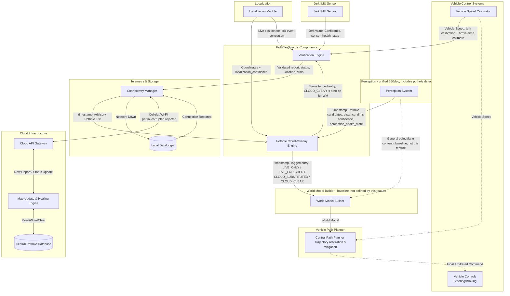

# Block diagram - Autonomous Vehicle Pothole Detection and Avoidance System

## Architectural Basis

This design is built on patterns documented in current AV perception/planning literature and patents, rather than an ad-hoc pipeline invented for this feature. Key assumptions and the basis for each:

1. **A dedicated World Model Builder, separate from both Perception and Path Planner.** Documented AV drive-stack architecture has a world model manager that consumes outputs from multiple distinct perception components (an obstacle perceiver, a path perceiver, a wait-condition perceiver, a map perceiver) and continually updates a unified world model as new inputs arrive, which then feeds planning and control [1]. This feature does not build or redefine that component — it is baseline vehicle architecture, in the same category as Path Planner itself; this feature's only responsibility is to correctly feed it (Section 5).
2. **A single, unified 360-degree perception system, not per-direction subsystems.** Multi-sensor AV perception is documented as fusing camera and LiDAR data from multiple zones into one unified representation rather than maintaining separate subsystems per direction [4]; some architectures fuse directly into a shared bird's-eye-view representation for exactly this reason [2].
3. **Detection, classification, and tracking are commonly distinct algorithmic stages within Perception** [3]. This diagram does not decompose Perception's internals to that level, consistent with system-level architecture abstraction.
4. **Perception stays lightweight: raw detection data only, no severity categorization or response planning.** Real-time multi-sensor fusion pipelines are documented as needing to trade model sophistication for feasibility on embedded, resource-constrained hardware [5]. This motivates keeping Perception's output limited to object geometry and a confidence score — severity interpretation and response strategy belong downstream, where they can draw on more context (Path Planner's own speed, cloud data) without adding to Perception's real-time burden.
5. **Multi-sensor redundancy across independent modalities is standard industry practice**, not a design choice specific to this feature — documented AV sensor suites (e.g., Waymo, Baidu Apollo) combine camera, LiDAR, and radar specifically for redundancy [3].

**References**
[1] NVIDIA, "Sensor fusion for autonomous machine applications using machine learning," U.S. Patent. https://image-ppubs.uspto.gov/dirsearch-public/print/downloadPdf/12307788
[2] Roberge, "BEVFusion: Unifying Vision in Autonomous Driving Systems," Medium, 2025. https://medium.com/demistify/av-vol-3-bevfusion-unifying-vision-in-autonomous-driving-systems-b2190f877c9b
[3] "Sensor Fusion and Perception for Autonomous Driving: A Critical Review of Modalities, AI Models, Algorithms, and Industry Configurations," MAKE, 2026. https://doi.org/10.3390/make8070199
[4] "A Review of Multi-Sensor Fusion in Autonomous Driving," MDPI Sensors, 2025. https://www.mdpi.com/1424-8220/25/19/6033
[5] "Real-Time Hybrid Multi-Sensor Fusion Framework for Perception in Autonomous Vehicles," MDPI Sensors, 2019. https://www.mdpi.com/1424-8220/19/20/4357

These are cited to explain *why* this architecture is shaped the way it is, not as a claim that this document reproduces any cited system exactly — the specific components below are this project's own design, built consistent with the patterns these sources document.

---

### 1. Perception (includes pothole detection)
A single, unified perception stack covering the full 360-degree field around the vehicle (Camera + LiDAR, fused into one representation), consistent with [2] and [4]. Internally comprises detection, classification, and tracking — commonly separate stages per [3] — not decomposed further in this diagram. Pothole detection is one object/hazard class among others (vehicles, pedestrians, lane markings), not a separate feature bolted onto Perception.
- **Output, per pothole candidate:** distance from ego vehicle, estimated dimensions, and a confidence score — basic tracking/distance and detection information only. Nothing about severity category or response strategy; that is Path Planner's job, not Perception's, consistent with [5].
- **Two independent signals, not derived from one another:** pothole_confidence_score is a per-detection quality signal, produced only when a candidate exists. perception_health_state (NOMINAL / DEGRADED / FAULTED) is a system-level compute/thermal status, independent of any specific detection's confidence. Under thermal throttling or fail-operational conditions, pothole classification is dropped first — Perception's own internal prioritization — while primary object detection continues; this is a statement about compute health, unrelated to how confident any given detection might be.
- **Output routing:** general object/lane content feeds the World Model Builder (Section 5) directly — baseline vehicle architecture, not defined by this feature. Pothole candidates feed the Pothole Cloud-Overlay Engine (Section 3), this feature's only consumer of Perception's pothole-specific output.

### 2. Jerk/IMU sensor
Reactive sensing unit, physically confirming contact with a road irregularity at the moment the vehicle drives over it — fundamentally different from Perception's proactive detection, since jerk data cannot exist before the vehicle reaches a hazard. Its only role is in the Verification Engine (Section 4), confirming or contradicting a candidate at the moment of encounter. Fails independently of the visual-artifact conditions that affect camera/LiDAR, consistent with the multi-modal-redundancy basis in [3]. Reports its own operational health state; a faulted sensor is treated by the Verification Engine as an unknown reading, not a confirmed absence of jerk.

### 3. Pothole Cloud-Overlay Engine
Single responsibility: produce one correctly-formatted pothole entry, sent to both the World Model Builder and the Verification Engine. This is the only component with visibility into both what the cloud currently expects and what Perception currently observes together — that combined view is what makes it, not Verification Engine, the right place to determine whether a cloud-expected pothole is genuinely gone.
- **Inputs:** Perception's pothole candidates and health state (Section 1); the Connectivity Manager's cloud-advisory pothole list; Localization coordinates and vehicle position.
- **Behavior — four branches:**
  - **Live detection present, unmatched:** a candidate exists with no corresponding cloud entry nearby — a genuinely new candidate the cloud does not yet know about. Forwarded as-is (entry_type: LIVE_ONLY).
  - **Live detection present, matched:** a candidate exists and correlates by position with a cloud-advisory entry. The cloud's recommended_speed_limit is attached as metadata (entry_type: LIVE_ENRICHED).
  - **No usable live detection, Perception degraded:** perception_health_state is DEGRADED or FAULTED, or confidence is too low to use — this engine cannot tell whether a cloud-expected pothole is genuinely absent or simply wasn't looked at properly. Falls back to the cloud-reported entry, positioned via Localization (entry_type: CLOUD_SUBSTITUTED).
  - **No usable live detection, Perception nominal, cloud expects a pothole here:** perception_health_state is NOMINAL, the vehicle's current position (via Localization) corresponds to a cloud-advisory entry, and no live candidate was produced at that location. This is a confident visual non-detection with healthy sensors — a materially stronger signal than the degraded-compute case above, and is tagged distinctly (entry_type: CLOUD_CLEAR).
- **Output:** one entry per candidate or cloud-expected location, tagged by entry_type, to both the World Model Builder (Section 5) and the Verification Engine (Section 4). World Model Builder treats CLOUD_CLEAR entries as a no-op — a confirmed absence isn't hazard content the world model needs to represent — while Verification Engine uses it as the primary signal for reporting CLEARED (Section 4).
- **Own real-time budget:** this engine's matching logic (correlating potentially multiple live candidates against a cloud-advisory list that can itself contain many entries in a dense area) has its own compute cost, separate from and in addition to the World Model Builder's and Path Planner's real-time budgets (Section 8) — see hara.md item #6.

### 4. Verification Engine
Single responsibility: determine and report a pothole's status to the cloud, using entry_type (from the Overlay Engine) combined with physical confirmation (from Jerk) as two independent signals — neither alone is treated as sufficient for a CLEARED determination.
- **Inputs:** the Overlay Engine's tagged entry (Section 3), which now carries lat/lon for every entry_type, not only cloud-sourced ones; Jerk sensor readings (Section 2), treated as an ongoing stream rather than a single point-in-time value; live Localization coordinates, distinct from the entry's static lat/lon — this tells Verification Engine where the vehicle currently is, so it can check that position against an entry's stored location at the moment a candidate jerk event arrives; Vehicle Speed, used both to calibrate jerk severity (the same jerk magnitude indicates a much deeper pothole at 15 mph than at 70 mph) and, combined with a live entry's distance_to_pothole_m and timestamp, to estimate roughly when to expect confirmation.
- **Correlating a jerk event to the right entry:** for LIVE_ONLY and LIVE_ENRICHED entries, both a kinematic estimate (distance + speed + timestamp) and a live position check are available and used together — the kinematic estimate alone is approximate, since vehicle speed can change between detection and arrival, especially if Path Planner brakes in response to the same detection. For CLOUD_SUBSTITUTED and CLOUD_CLEAR entries, which carry no live distance measurement, the live position check is the only correlation mechanism available.
- **Behavior:**
  - LIVE_ONLY + jerk confirms -> NEW
  - LIVE_ENRICHED or CLOUD_SUBSTITUTED + jerk confirms -> ACTIVE
  - CLOUD_CLEAR + jerk does not fire (expected, consistent) -> CLEARED
  - CLOUD_CLEAR + jerk unexpectedly fires -> ACTIVE (physical evidence overrides a visual non-detection, not the other way around)
  - Any other combination (jerk absent for LIVE_ONLY, LIVE_ENRICHED, or CLOUD_SUBSTITUTED) -> no report. Jerk absence alone is ambiguous — it could mean the pothole isn't there, or that Path Planner successfully executed an avoidance maneuver and the vehicle never drove over it. This feature has no visibility into, and no need to know about, what maneuver Path Planner executed or whether one occurred at all — it simply does not assert a status it cannot support. Only the Overlay Engine's CLOUD_CLEAR determination, based on a confident visual re-scan with healthy sensors, is treated as sufficient grounds for CLEARED.
- **Output:** a validated report (status, location, dimensions) to the Connectivity Manager, using the lat/lon it received on the entry directly. Does not feed the world model or Path Planner.

### 5. World Model Builder (baseline — not defined by this feature)
Consumes outputs from Perception and other vehicle perceivers, including this feature's tagged pothole entries (Section 3), and continually maintains the unified world model Path Planner consumes, consistent with [1]. CLOUD_CLEAR entries are ignored — a confirmed absence is not hazard content. This feature contributes one input to it; it does not define, own, or redraw this component's own internal structure or its other inputs.

### 6. Telemetry & Storage Layer (Communication)
- **Connectivity Manager:** Sends the Verification Engine's validated reports to the Cloud Server, and supplies the cloud-advisory pothole list to the Pothole Cloud-Overlay Engine (Section 3). Intermittent, partial, or corrupted-in-transit messages — distinct from a clean full disconnection — are rejected outright and not partially processed.

    Note: The Connectivity Manager is assumed to authenticate and validate all incoming cloud data (anti-spoofing, checksum, format checks) at the point it receives it from the network, before forwarding to any consumer. Baseline architecture — Connectivity Manager almost certainly serves cloud-connected vehicle features beyond this one, so this function is not this feature's to define.

- **Local Datalogger (The Fallback):** If cellular/Wi-Fi connection drops entirely, this logs the encrypted data locally. Upon reaching a service bay or re-establishing connection, it executes a bulk sync.

### 7. Cloud Infrastructure (Fleet Intelligence)
- **Central Pothole Database:** Stores all geotagged anomalies reported by the fleet.
- **Map Update & Healing Engine:** Aggregates data. If a vehicle reports a pothole, it adds it. If multiple vehicles report CLEARED for a known pothole location, this engine clears it from the database. The aggregation logic's independence assumptions (e.g., whether it weights reports differently based on how a CLEARED status was reached) are not defined by this feature. Also where recommended_speed_limit is computed — a more sophisticated, non-real-time algorithm, consistent with the edge/cloud compute-split basis in [5].
- **Downstream API:** Broadcasts upcoming road conditions to vehicles in the specific geographic sector.

### 8. Path planner and Vehicle controls
- **Path Planning System:** Ingests the world model from the World Model Builder (Section 5) — its only input, for this feature or any other perceiver. This feature has no direct connection to Path Planner at all. Computes its own severity response — Perception and the Overlay Engine send only confidence, dimensions, distance (or, for cloud-substituted entries, severity_index and recommended_speed_limit), never a pre-decided response category; Path Planner combines this with its own current-speed reading (Baseline Dependency A) to compute an actual bounded response. Bounds the magnitude of any pothole-avoidance response to a low, pre-set ceiling regardless of how the vehicle's existing arbitration logic weighs it against other candidates.
- **Vehicle Controls (Actuation):** Executes the steering or braking commands generated by the Path Planning System. This connection (Baseline Dependency B) is pre-existing vehicle architecture — this feature does not define it.

**Note on connections not defined by this feature:** Vehicle Speed Calculator → Central Path Planner (Path Planner's own speed input), the World Model Builder → Path Planner connection (Section 5), and Central Path Planner → Vehicle Controls are all baseline vehicle architecture, not drawn as feature-specific interfaces.

---

## Version History

**Version 1 — Initial draft.** Perception (forward-only, implicitly dedicated), Jerk/IMU, Sensor Fusion, Localization, Geotagging & Verification Engine, Telemetry & Storage, Cloud Infrastructure, Path Planner, and Vehicle Controls, as a single linear pipeline.

**Version 2.** Added health/confidence signaling; an Enablement Gate; an Output Arbitrator selecting between real-time and cloud-advisory records; a split of the original Geotagging & Verification Engine into three components; a coarse braking_level category; explicit rejection of intermittent/partial cloud data.

**Version 3.** 
 - Feature updated to be inline with state of the art AV architecture. World Model Builder introduced as explicit baseline architecture. Path Planner's only input became the World Model Builder's output.
 - Introduced Pothole Cloud-Overlay Engine.
 - Central Path Planner → Vehicle Controls moved from a feature-defined interface to Baseline Dependency