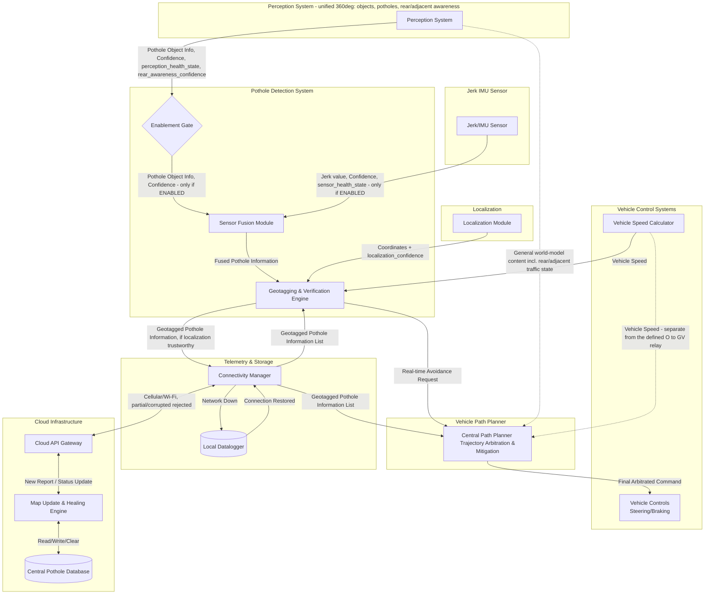

# Block diagram - Autonomous Vehicle Pothole Detection and Avoidance System

### 1. Perception and Jerk/IMU sensor
- **Perception system:** A single, unified perception stack covering the full 360-degree field around the vehicle (Camera + LiDAR, distributed across front/side/rear sensor zones and fused into one world model), consistent with standard practice in modern AV architectures — not separate subsystems per direction. This one system produces general object detection and classification (vehicles, pedestrians, other road objects, including rear and adjacent-lane traffic), forward-path pothole detection, and its own compute health state, all as outputs of the same fused world model. Pothole detection is one consumer of this shared output, not a dedicated pipeline.
  - **Compute health:** the Perception system reports its own health state (NOMINAL / DEGRADED / FAULTED) alongside its detection output. On thermal throttling or any fail-operational condition that reduces available compute, pothole detection is disabled while primary object detection (vehicles, pedestrians) continues — pothole detection is the lower-priority consumer of this shared resource and is dropped first under compute pressure.
- **Jerk/IMU sensor:** Jerk or IMU sensor working as reactive sensing unit to detect sudden vertical spikes. Reports its own operational health state alongside jerk readings; a faulted sensor is treated by Sensor Fusion as an unknown reading, not as a confirmed absence of jerk (see Section 3). Physically confirms contact with a road irregularity, a function camera/LiDAR cannot perform even in principle (they can only detect ahead of the vehicle, never at the moment of contact), and fails independently of the visual-artifact conditions (shadows, tar patches) that affect camera/LiDAR.

### 2. Enablement Gate
A gating function within the Pothole Detection System, sitting between Perception and Sensor Fusion — before fusion compute is spent, not after. It decides whether pothole-specific processing runs at all for a given cycle.
- **Inputs:** Perception's own compute health state and its confidence in current rear/adjacent-lane awareness — both part of the same fused world-model output described in Section 1.
- **Output:** ENABLED / DISABLED. When DISABLED (Perception degraded/faulted, or rear-awareness confidence indicating degraded/unavailable), Sensor Fusion does not run for that cycle at all — no fusion compute is spent on unreliable input, and neither the real-time avoidance path nor the cloud-reporting path is exercised.
- **Rationale for placement:** gating after Sensor Fusion would mean the fusion compute has already been spent by the time the gate decides to discard the result — pointless under exactly the compute-pressure conditions (thermal throttling) the gate exists to respond to. Gating before Fusion, directly on Perception's own health signal, avoids that waste.

### 3. Sensor fusion module
Runs only when the Enablement Gate is ENABLED. Receives inputs from Perception system and the Jerk Sensor. It calculates a "Pothole Confidence Score." (e.g., High visual confidence + Jerk = High confidence on pothold detection. Low visual confidence + Jerk = Medium confidence on pothole detection. High visual confidence + No Jerk = Low confidence on pothold detection.). If the Jerk sensor's health state is FAULTED, Sensor Fusion treats the jerk input as unknown/unavailable, not as a genuine zero-jerk reading, and does not let it suppress an otherwise-valid visual confidence score.

### 4. Localization
One of the key requirements is to store pothole location to enable better rider experience in future for any AV in the fleet. GPS and HD Map integration to provide precise coordinates for the vehicle at any given millisecond. Reports its own confidence/health state (analogous to the Jerk sensor's health field) alongside coordinates, so drift or loss of position fix can be detected downstream rather than silently trusted.

### 5. Geotagging & Verification Engine
- **Geotagger:** Tags the confirmed pothole with exact coordinates from the Localization Module.
- **Verification Engine:** Compares the Cloud's "expected" pothole against the Geotagged pothole information. Sends a "Pothole Active" or "Pothole Cleared" status back to the Connectivity Manager.
- **Response to degraded localization:** localization confidence, not Perception health, governs this block's own internal split in behavior — it does not go through the Enablement Gate. If Localization reports degraded confidence or a lost position fix, this block suppresses geotagging and cloud reporting (the pothole cannot be reliably located for the fleet map) but still forwards the real-time avoidance request to the Path Planner using relative detection data (dimensions, confidence, encounter speed) — the real-time avoidance decision does not require absolute coordinates, only geotagging does.

### 6. Telemetry & Storage Layer (Communication)
- **Connectivity Manager:** Attempts to send the geotagged pothole data and pothole verification status to the Cloud Server. Intermittent, partial, or corrupted-in-transit messages — over the cellular/Wi-Fi link, distinct from a clean full disconnection — are rejected outright and not partially processed; a message is either received complete and valid, or treated as not received at all.
- **Local Datalogger (The Fallback):** If cellular/Wi-Fi connection drops entirely, this logs the encrypted data locally. Upon reaching a service bay or re-establishing connection, it executes a bulk sync.

### 7. Cloud Infrastructure (Fleet Intelligence)
- **Central Pothole Database:** Stores all geotagged anomalies reported by the fleet.
- **Map Update & Healing Engine:** Aggregates data. If a vehicle reports a pothole, it adds it. If multiple vehicles pass a known pothole location and report "no anomaly detected," this engine clears the pothole from the database.
- **Downstream API:** Broadcasts upcoming road conditions to vehicles in the specific geographic sector.

### 8. Path planner and Vehicle controls
- **Path Planning System:** Ingests the cloud data and real-time geotagged pothole information. If a pothole is 200 meters ahead, it calculates the optimal mitigation strategy (e.g., nudge left, change lane, or smooth braking) based on real-time driving conditions keeping rider safety at highest priority. Treats the real-time reactive path (from the Geotagging & Verification Engine) and the cloud/advisory path (from the Connectivity Manager) as independent — the advisory layer being wrong, delayed, or entirely absent never gates or overrides the reactive layer. Bounds the magnitude of any pothole-avoidance response to a low, pre-set ceiling, so this request can never itself demand more than a minor, low-severity adjustment regardless of how the vehicle's existing arbitration logic weighs it against other candidates.
- **Vehicle Controls (Actuation):** Executes the steering or braking commands generated by the Path Planning System.

**Note on connections not defined by this feature:** two connections are shown as dotted rather than solid. 
1. Perception System → Central Path Planner: the general world-model content Path Planner needs for its own driving decisions (including rear/adjacent-lane traffic state), beyond the pothole-specific subset this feature routes through its own pipeline — sourced from the same unified Perception system as Section 1, not a separate one.
2. Vehicle Speed Calculator → Central Path Planner: the Path Planner's own general-purpose speed input, separate from the defined Vehicle Speed Calculator → Geotagging & Verification Engine relay, which exists specifically to give this feature severity context. Both sources are already defined elsewhere in this diagram; only the protocol and full payload of these particular connections is unspecified here, since they are baseline vehicle functionality, not specific to this feature.

---

## Version History

**Version 1 — Initial draft.** Perception (forward-only, implicitly dedicated), Jerk/IMU, Sensor Fusion, Localization, Geotagging & Verification Engine, Telemetry & Storage, Cloud Infrastructure, Path Planner, and Vehicle Controls, as a single linear pipeline with no health/confidence signaling, no gating, and no explicit statement of independence between the real-time and cloud/advisory paths.

**Version 2 — Current.** Changes made following safety analysis of Version 1:
- Perception clarified as a single, unified 360-degree perception stack (not forward-only, not a separate subsystem per direction) producing general object detection, forward pothole detection, rear/adjacent-lane awareness, and its own health state from one fused world model — consistent with standard modern AV architecture. Pothole detection is disabled under degraded compute while primary object detection continues.
- Enablement Gate added, sitting before Sensor Fusion, gating on Perception's health and rear-awareness confidence (both part of the same unified output) so fusion compute is never spent on unreliable input.
- Localization now reports a confidence/health state alongside coordinates; Geotagging & Verification Engine's response to degraded localization is now explicit (suppress geotagging/cloud reporting, continue real-time avoidance on relative data).
- Connectivity Manager's handling of intermittent/partial/corrupted-in-transit messages is now explicit (rejected outright, not partially processed).
- Path Planner's independence from the cloud/advisory path is now explicitly stated, rather than only inferable from the interfaces.
- Path Planner's treatment of a pothole-avoidance request's magnitude is now bounded explicitly, rather than left to unstated arbitration behavior.
- Two connections this feature relies on but does not define — Perception's general world-model output and a direct vehicle-speed feed, both terminating at Path Planner — are now drawn as dotted lines rather than omitted entirely. An earlier draft of this revision modeled rear/adjacent-lane awareness as a separate, undocumented perception system; this was corrected to source it from the same unified Perception system as everything else, consistent with how modern AV architectures are actually built.
- An explicit priority-tagging mechanism (Path Planner arbitrating pothole requests via an appended priority field) was evaluated during this revision and deliberately not adopted — it would have added new interface fields and new Path Planner logic to an already real-time-constrained, safety-critical component, for a goal already achieved more simply by the magnitude bound above combined with the vehicle's existing arbitration logic.