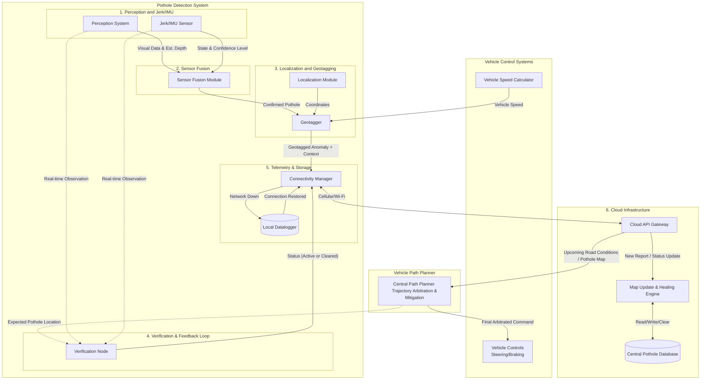

# Block diagram - Autonomous Vehicle Pothole Detection and Avoidance System

### 1. Perception and Jerk/IMU sensor
- **Perception system:** Perception system (Camera + LIDAR) scanning forward path for pothole detection.
- **Jerk/IMU sensor:** Jerk or IMU sensor working as reactive sensing unit to detect sudden vertical spikes.

### 2. Sensor fusion module
Receives inputs from Perception system and the Jerk Sensor. It calculates a "Pothole Confidence Score." (e.g., High visual confidence + Jerk = High confidence on pothold detection. Low visual confidence + Jerk = Medium confidence on pothole detection. High visual confidence + No Jerk = Low confidence on pothold detection.).

### 3. Localization and Geo tagger
- **Localization:** One of the key requirement is to store pothole location to enable better rider experience in future for any AV in the fleet. GPS and HD Map integration to provide precise coordinates for the vehicle at any given millisecond.
- **Geotagger:** Tags the confirmed pothole with exact coordinates from the Localization Module.

### 4. Telemetry & Storage Layer (Communication)
- **Connectivity Manager:** Attempts to send the geotagged pothole data  and pothole verification status to the Cloud Server.
- **Local Datalogger (The Fallback):** If cellular/Wi-Fi connection drops, this logs the encrypted data locally. Upon reaching a service bay or re-establishing connection, it executes a bulk sync.

### 5. Cloud Infrastructure (Fleet Intelligence)
- **Central Pothole Database:** Stores all geotagged anomalies reported by the fleet.
- **Map Update & Healing Engine:** Aggregates data. If a vehicle reports a pothole, it adds it. If multiple vehicles pass a known pothole location and report "no anomaly detected," this engine clears the pothole from the database.
- **Downstream API:** Broadcasts upcoming road conditions to vehicles in the specific geographic sector.

### 6. Verification & Feedback Loop
Compares the Cloud's "expected" pothole against the Perception/Jerk real-time data. Sends a "Pothole Active" or "Pothole Cleared" status back to the Connectivity Manager.

### 7. Path planner and Vehicle controls
- **Path Planning System:** Ingests the cloud data. If a pothole is 200 meters ahead, it calculates the optimal mitigation strategy (e.g., nudge left, change lane, or smooth braking) based on real-time driving conditions keeping rider safety at highest priority.
- **Vehicle Controls (Actuation):** Executes the steering or braking commands generated by the Path Planning System.

