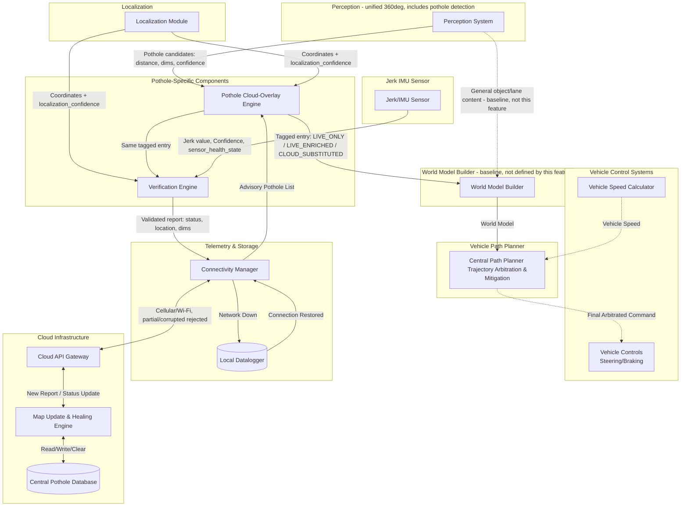

# Block diagram - Autonomous Vehicle Pothole Detection and Avoidance System

## Architectural Basis

This design is built on patterns documented in current AV perception/planning literature and patents, rather than an ad-hoc pipeline invented for this feature. Key assumptions and the basis for each:

1. **A dedicated World Model Builder, separate from both Perception and Path Planner.** Documented AV drive-stack architecture has a world model manager that consumes outputs from multiple distinct perception components (an obstacle perceiver, a path perceiver, a wait-condition perceiver, a map perceiver) and continually updates a unified world model as new inputs arrive, which then feeds planning and control [1]. This feature does not build or redefine that component — it is baseline vehicle architecture, in the same category as Path Planner itself; this feature's only responsibility is to correctly feed it (Section 5).
2. **A single, unified 360-degree perception system, not per-direction subsystems.** Multi-sensor AV perception is documented as fusing camera and LiDAR data from multiple zones into one unified representation rather than maintaining separate subsystems per direction [4]; some architectures fuse directly into a shared bird's-eye-view representation for exactly this reason [2].
3. **Detection, classification, and tracking are commonly distinct algorithmic stages within Perception** [3]. This diagram does not decompose Perception's internals to that level, consistent with system-level architecture abstraction.
4. **Perception stays lightweight: raw detection data only, no severity categorization or response planning.** Real-time multi-sensor fusion pipelines are documented as needing to trade model sophistication for feasibility on embedded, resource-constrained hardware [5]. This motivates keeping Perception's output limited to object geometry and a confidence score — severity interpretation and response strategy belong downstream, where they can draw on more context (Path Planner's own speed, cloud data) without adding to Perception's real-time burden.
5. **Multi-sensor redundancy across independent modalities is standard industry practice**, not a design choice specific to this feature — documented AV sensor suites (e.g., Waymo, Baidu Apollo) combine camera, LiDAR, and radar specifically for redundancy [3].

**References**
[1] NVIDIA, "Sensor fusion for autonomous machine applications using machine learning," U.S. Patent. https://image-ppubs.uspto.gov/dirsearch-public/print/downloadPdf/12307788
[2] Roberge, "BEVFusion: Unifying Vision in Autonomous Driving Systems," Medium, 2025. https://medium.com/demistify/av-vol-3-bevfusion-unifying-vision-in-autonomous-driving-systems-b2190f877c9b
[3] "Sensor Fusion and Perception for Autonomous Driving: A Critical Review of Modalities, AI Models, Algorithms, and Industry Configurations," MAKE, 2026. https://doi.org/10.3390/make8070199
[4] "A Review of Multi-Sensor Fusion in Autonomous Driving," MDPI Sensors, 2025. https://www.mdpi.com/1424-8220/25/19/6033
[5] "Real-Time Hybrid Multi-Sensor Fusion Framework for Perception in Autonomous Vehicles," MDPI Sensors, 2019. https://www.mdpi.com/1424-8220/19/20/4357

These are cited to explain *why* this architecture is shaped the way it is, not as a claim that this document reproduces any cited system exactly — the specific components below are this project's own design, built consistent with the patterns these sources document.

---

### 1. Perception (includes pothole detection)
A single, unified perception stack covering the full 360-degree field around the vehicle (Camera + LiDAR, fused into one representation), consistent with [2] and [4]. Internally comprises detection, classification, and tracking — commonly separate stages per [3] — not decomposed further in this diagram. Pothole detection is one object/hazard class among others (vehicles, pedestrians, lane markings), not a separate feature bolted onto Perception.
- **Output, per pothole candidate:** distance from ego vehicle, estimated dimensions, and a confidence score — basic tracking/distance and detection information only. Nothing about severity category or response strategy; that is Path Planner's job, not Perception's, consistent with [5].
- **Two independent signals, not derived from one another:** pothole_confidence_score is a per-detection quality signal, produced only when a candidate exists. perception_health_state (NOMINAL / DEGRADED / FAULTED) is a system-level compute/thermal status, independent of any specific detection's confidence. Under thermal throttling or fail-operational conditions, pothole classification is dropped first — Perception's own internal prioritization — while primary object detection continues; this is a statement about compute health, unrelated to how confident any given detection might be.
- **Output routing:** general object/lane content feeds the World Model Builder (Section 5) directly — baseline vehicle architecture, not defined by this feature. Pothole candidates feed the Pothole Cloud-Overlay Engine (Section 3), this feature's only consumer of Perception's pothole-specific output.

### 2. Jerk/IMU sensor
Reactive sensing unit, physically confirming contact with a road irregularity at the moment the vehicle drives over it — fundamentally different from Perception's proactive detection, since jerk data cannot exist before the vehicle reaches a hazard. Its only role is in the Verification Engine (Section 4), confirming or contradicting a candidate at the moment of encounter. Fails independently of the visual-artifact conditions that affect camera/LiDAR, consistent with the multi-modal-redundancy basis in [3]. Reports its own operational health state; a faulted sensor is treated by the Verification Engine as an unknown reading, not a confirmed absence of jerk.

### 3. Pothole Cloud-Overlay Engine
Single responsibility: produce one correctly-formatted pothole entry, sent to both the World Model Builder and the Verification Engine.
- **Inputs:** Perception's pothole candidates (Section 1); the Connectivity Manager's cloud-advisory pothole list; Localization coordinates and vehicle position.
- **Behavior — two branches:**
  - **VALID Live detection present:** keep it; attempt to match against the cloud-advisory list by position. If matched, attach the cloud's recommended_speed_limit as metadata (entry_type: LIVE_ENRICHED). If unmatched, forward as-is (entry_type: LIVE_ONLY) — a genuinely new candidate the cloud does not yet know about.
  - **No usable live detection** (low confidence, or Perception has dropped pothole classification under compute pressure — this engine does not need to know which): use Localization and vehicle position to place the cloud-reported entry directly (entry_type: CLOUD_SUBSTITUTED).
- **Output:** one entry per candidate, tagged by entry_type, to both the World Model Builder (Section 5) and the Verification Engine (Section 4). The tag itself tells Verification whether the cloud already expected this pothole, without Verification needing its own connection to the cloud's expected-list to find out.

### 4. Verification Engine
Single responsibility: validate or invalidate a pothole entry using physical confirmation, and report status to the cloud. Consumes the Overlay Engine's already-reconciled entry (Section 3).
- **Inputs:** the Overlay Engine's tagged entry (Section 3); Jerk sensor readings (Section 2), consumed as the vehicle reaches the location; Localization coordinates, needed to attach report coordinates for LIVE_ONLY and LIVE_ENRICHED entries, which do not carry lat/lon (Path Planner has no use for it there — see Section 5's rationale).
- **Behavior:** the entry_type tag alone indicates whether the cloud already expected this pothole (LIVE_ENRICHED or CLOUD_SUBSTITUTED) or not (LIVE_ONLY); combined with jerk confirming or contradicting physical presence, this determines NEW / ACTIVE / CLEARED.
- **Output:** a validated report (status, location, dimensions) to the Connectivity Manager. Does not feed the world model or Path Planner.

### 5. World Model Builder (baseline — not defined by this feature)
Consumes outputs from Perception and other vehicle perceivers, including this feature's tagged pothole entries (Section 3), and continually maintains the unified world model Path Planner consumes, consistent with [1]. This feature contributes one input to it; it does not define, own, or redraw this component's own internal structure or its other inputs.

### 6. Telemetry & Storage Layer (Communication)
- **Connectivity Manager:** Sends the Verification Engine's validated reports to the Cloud Server, and supplies the cloud-advisory pothole list to the Pothole Cloud-Overlay Engine (Section 3). Intermittent, partial, or corrupted-in-transit messages — distinct from a clean full disconnection — are rejected outright and not partially processed.
- **Local Datalogger (The Fallback):** If cellular/Wi-Fi connection drops entirely, this logs the encrypted data locally. Upon reaching a service bay or re-establishing connection, it executes a bulk sync.

### 7. Cloud Infrastructure (Fleet Intelligence)
- **Central Pothole Database:** Stores all geotagged anomalies reported by the fleet.
- **Map Update & Healing Engine:** Aggregates data. If a vehicle reports a pothole, it adds it. If multiple vehicles pass a known pothole location and report "no anomaly detected," this engine clears the pothole from the database. Also where recommended_speed_limit is computed — a more sophisticated, non-real-time algorithm, consistent with the edge/cloud compute-split basis in [5].
- **Downstream API:** Broadcasts upcoming road conditions to vehicles in the specific geographic sector.

### 8. Path planner and Vehicle controls
- **Path Planning System:** Ingests the world model from the World Model Builder (Section 5) — its only input, for this feature or any other perceiver. This feature has no direct connection to Path Planner at all. Computes its own severity response — Perception and the Overlay Engine send only confidence, dimensions, distance (or, for cloud-substituted entries, severity_index and recommended_speed_limit), never a pre-decided response category; Path Planner combines this with its own current-speed reading (Baseline Dependency A) to compute an actual bounded response. Bounds the magnitude of any pothole-avoidance response to a low, pre-set ceiling regardless of how the vehicle's existing arbitration logic weighs it against other candidates.
- **Vehicle Controls (Actuation):** Executes the steering or braking commands generated by the Path Planning System. This connection (Baseline Dependency B) is pre-existing vehicle architecture — this feature does not define it.

**Note on connections not defined by this feature:** Vehicle Speed Calculator → Central Path Planner (Path Planner's own speed input), the World Model Builder → Path Planner connection (Section 5), and Central Path Planner → Vehicle Controls are all baseline vehicle architecture, not drawn as feature-specific interfaces.

---

## Version History

**Version 1 — Initial draft.** Perception (forward-only, implicitly dedicated), Jerk/IMU, Sensor Fusion, Localization, Geotagging & Verification Engine, Telemetry & Storage, Cloud Infrastructure, Path Planner, and Vehicle Controls, as a single linear pipeline.

**Version 2.** Added health/confidence signaling; an Enablement Gate; an Output Arbitrator selecting between real-time and cloud-advisory records; a split of the original Geotagging & Verification Engine into three components; a coarse braking_level category; explicit rejection of intermittent/partial cloud data.

**Version 3.** 
 - Feature updated to be inline with state of the art AV architecture. World Model Builder introduced as explicit baseline architecture. Path Planner's only input became the World Model Builder's output.
 - Introduced Pothole Cloud-Overlay Engine.
 - Central Path Planner → Vehicle Controls moved from a feature-defined interface to Baseline Dependency